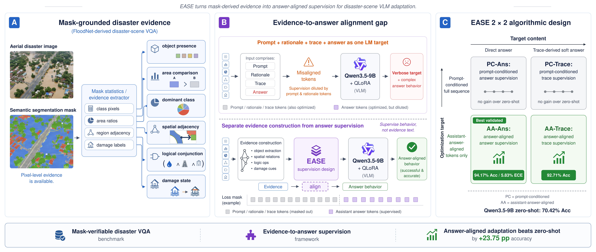
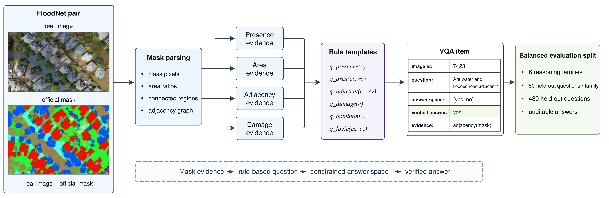
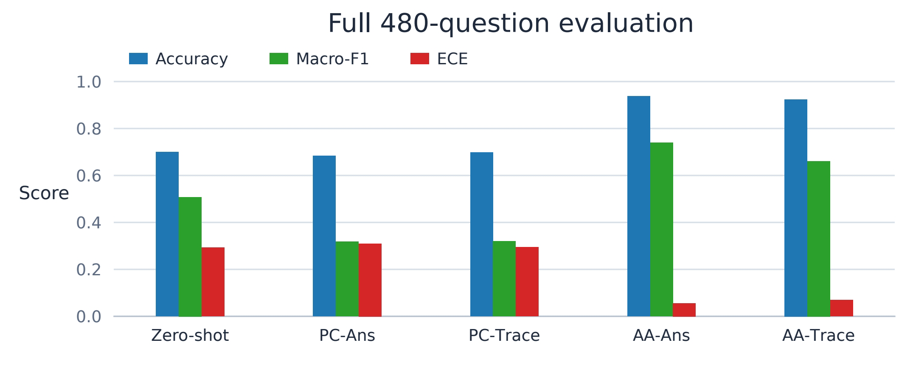
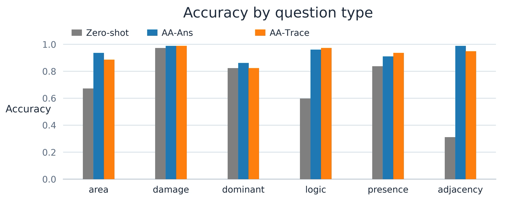
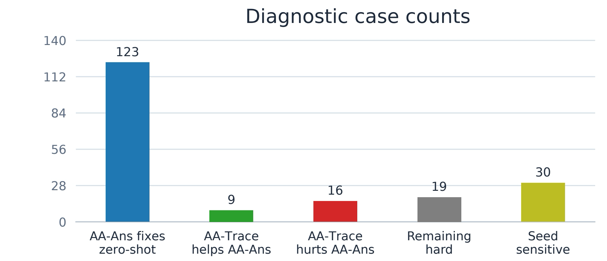

# EASE: Evidence-to-Answer Supervision for Disaster-Scene Vision-Language Adaptation

[](#citation) [](#quick-start) [](#overview) [](#experiments) [](#method)

Research code for **EASE**, by **Haoze Zheng** and **Yaping Han**, accepted to **ACML 2026**.

[Overview](#overview) · [Method](#method) · [Structure](#repository-structure) · [Quick start](#quick-start) · [Experiments](#experiments) · [Results](#results) · [Citation](#citation) · [Authors and acknowledgments](#authors-and-acknowledgments)

## Overview

EASE studies disaster-scene visual question answering using FloodNet aerial images and semantic masks. It separates **loss support** (full-sequence PC versus answer-aligned AA) from **target construction** (verified direct answers versus trace-derived answers). Models receive only the image, question, and answer choices at inference time.

The main finding is that answer-aligned loss improves accuracy more consistently than changing answer targets to trace-derived targets. The paper reports a **23.58 ± 0.34 percentage-point** AA-versus-PC gap across three Qwen runs.

## Method

| Cell | Optimized tokens | Training target |
|---|---|---|
| PC-Ans | All non-padding tokens | Verified direct answer |
| PC-Trace | All non-padding tokens | Evidence and trace-derived answer |
| AA-Ans | Final answer tokens | Verified direct answer |
| AA-Trace | Final answer tokens | Evidence and trace-derived answer; evidence is masked from loss |

Image–mask pairs are split by sequence, converted into six question families, and checked with mask-grounded evidence programs. The four cells share training examples, order, and adaptation settings.



## Repository structure

```text
EASE_ACML2026_code/
├── README.md                      # project instructions and paper citation
├── CITATION.cff                   # GitHub citation metadata
├── pyproject.toml                 # installation and dependencies
├── configs/data/floodnet_v1.yaml   # dataset paths and construction parameters
├── src/floodnet_rcmtd/
│   ├── data/                      # image/mask pairs, splits, questions, audits
│   ├── traces/                    # mask-grounded evidence programs
│   ├── distillation/              # direct and trace-derived targets
│   └── ease2026/                  # training, evaluation, metrics, diagnostics
├── scripts/plot_results.py        # result plots
├── results/                       # 12 paper result tables (CSV)
├── figure/                        # Figure1.png ... Figure5.png
└── tests/                         # data, evidence, training protocol, analysis
```

The archive contains data-processing code and dataset statistics. Download FloodNet separately to the Linux data directory. The five paper images are included at `figure/Figure1.png` through `figure/Figure5.png`.

## Quick start

Use Python **3.11 or 3.12**. Training and model evaluation require a **CUDA Linux GPU** and local model weights. Keep large datasets, weights, and checkpoints on Windows/Linux; Mac handles code, control, and analysis.

```bash
python3.11 -m venv .venv
source .venv/bin/activate
python -m pip install -e '.[ease2026,analysis,dev]'
pytest -q
```

Edit `data_root` and `output_root` in [configs/data/floodnet_v1.yaml](configs/data/floodnet_v1.yaml), then prepare the data:

```bash
floodnet-rcmtd build-split --config configs/data/floodnet_v1.yaml
floodnet-rcmtd build-questions --config configs/data/floodnet_v1.yaml
floodnet-rcmtd audit-questions --config configs/data/floodnet_v1.yaml
ease2026 prepare --manifest /data/ease/derived/manifest.json --output /data/ease/vqa
ease2026 audit --data-dir /data/ease/vqa
```

Preparation exports train/test JSONL records and checks that questions, images, masks, and sequence groups do not overlap across splits. The paper reports **2,343 image–mask pairs** and **480 test questions**, with **80 per family**: object presence, damage state, area comparison, spatial adjacency, dominant class, and logical conjunction.



## Experiments

| Code | Purpose |
|---|---|
| `data/`, `traces/`, `distillation/` | Dataset construction and verified answer targets |
| `ease2026/prepare.py` | Export training/evaluation records and validate splits |
| `ease2026/protocol.py` | PC/AA token supervision |
| `ease2026/runner.py` | Qwen/GLM QLoRA training and evaluation |
| `ease2026/normalization.py` | Constrain generated answers to valid labels |
| `ease2026/summary.py`, `diagnostics.py` | Metrics, confusion matrices, and paired cases |

Defaults: NF4 QLoRA, rank **16**, alpha **32**, dropout **0.05**, learning rate **1e-4**, **480** optimizer updates, **16** accumulation microsteps, image area capped at **262,144** pixels, and thinking disabled.

```bash
ease2026 train --data-dir /data/ease/vqa --output-root /data/ease/runs \
  --backbone qwen --model-path /data/models/Qwen3.5-9B --seed 1 --cell AA-Ans

ease2026 evaluate --data-dir /data/ease/vqa --output-root /data/ease/runs \
  --backbone qwen --model-path /data/models/Qwen3.5-9B --seed 1 \
  --cell AA-Ans --mode candidate

ease2026 summarize --output-root /data/ease/runs --backbone qwen \
  --seeds 1 --cells AA-Ans --mode candidate --output /data/ease/summary.json

ease2026 analyze --output-root /data/ease/runs --backbone qwen \
  --seed 1 --mode generation --data-dir /data/ease/vqa --output /data/ease/diagnostics

python scripts/plot_results.py --results-dir results --output plots
```

Choose `PC-Ans`, `PC-Trace`, `AA-Ans`, or `AA-Trace` for training, and `Zero-shot` for baseline evaluation. For GLM, use `--backbone glm` with its local model path. `--mode generation` enables greedy decoding; candidate scoring records probabilities for ECE. Generation confidence is `null`.

The seed argument controls randomness for an individual run; the example value above is illustrative. Use the same value across compared cells. `analyze` requires generation outputs for Zero-shot and all four adapted cells. Use `ease2026 <command> --help` for all options.

Outputs are written under `runs/<backbone>/seed<seed>/<cell>/`: adapter weights, processor, run metadata, training loss, and evaluation predictions. Metric summaries and paired diagnostics are written to the requested output paths.

## Results

The 12 CSV files contain **paper-reported aggregate results** and representative cases. New experiment outputs are stored separately in the chosen output directory.

**Qwen3.5-9B, three-run mean ± standard deviation (%):**

| Method | Accuracy | Macro-F1 | Reported ECE |
|---|---:|---:|---:|
| Zero-shot | 70.42 | 51.09 | 29.58 |
| PC-Ans | 69.10 ± 0.43 | 32.28 ± 0.62 | 31.17 ± 0.43 |
| PC-Trace | 70.14 ± 0.32 | 32.48 ± 0.71 | 29.87 ± 0.31 |
| AA-Ans | **93.54 ± 0.63** | **69.90 ± 4.22** | **6.46 ± 0.63** |
| AA-Trace | 92.85 ± 0.43 | 67.17 ± 1.72 | 7.12 ± 0.36 |

The primary Qwen run reaches **94.17%** for AA-Ans and **92.71%** for AA-Trace with generation. GLM reaches **90.21%** and **89.79%**, respectively; its average AA-versus-PC gap is **21.56 percentage points**.



AA-Ans improves spatial adjacency from **31.25% to 98.75%**, conjunction from **60.00% to 96.25%**, and area comparison from **67.50% to 93.75%**. Dominant-class errors are associated with small differences between the two largest regions.



AA-Ans fixes **123** zero-shot errors. AA-Trace helps **9** AA-Ans cases and hurts **16**; **19** cases remain hard. These are separate diagnostic counts.



| Analysis | Result files |
|---|---|
| Dataset | [dataset_statistics.csv](results/dataset_statistics.csv) |
| Backbone metrics | [qwen_three_seed.csv](results/qwen_three_seed.csv), [qwen_primary_seed.csv](results/qwen_primary_seed.csv), [glm_single_seed.csv](results/glm_single_seed.csv) |
| Loss alignment and question families | [alignment_gap.csv](results/alignment_gap.csv), [question_family_accuracy.csv](results/question_family_accuracy.csv) |
| Prediction and evidence diagnostics | [prediction_behavior.csv](results/prediction_behavior.csv), [dominant_class_diagnostics.csv](results/dominant_class_diagnostics.csv), [trace_support_diagnostics.csv](results/trace_support_diagnostics.csv), [trace_regression_diagnostics.csv](results/trace_regression_diagnostics.csv) |
| Cases | [case_diagnostics.csv](results/case_diagnostics.csv), [qualitative_cases.csv](results/qualitative_cases.csv) |

## Citation

Accepted to **ACML 2026**. Proceedings details can be added when available.

```bibtex
@inproceedings{zheng2026ease,
  title     = {EASE: Evidence-to-Answer Supervision for Disaster-Scene Vision-Language Adaptation},
  author    = {Zheng, Haoze and Han, Yaping},
  booktitle = {Proceedings of the Asian Conference on Machine Learning},
  year      = {2026}
}
```

## Authors and acknowledgments

- **Haoze Zheng** — School of Computer Science and Technology, Xinjiang University; `zhenghaoze@stu.xju.edu.cn`
- **Yaping Han** — School of Geography and Remote Sensing Science, Xinjiang University; `20231203205@stu.xju.edu.cn`

We thank the FloodNet creators, Qwen and GLM teams, and the developers of PyTorch, Transformers, PEFT, and the Python research ecosystem. Follow the dataset/model licenses; contact the authors for code reuse terms.
